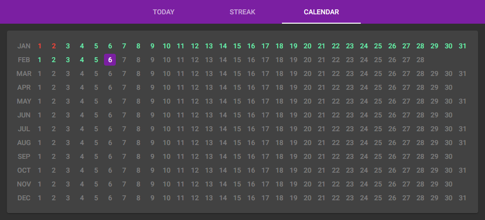

# EDC

Self-hosted web app to help you build good habits by doing things every day. Inspired by the [Every Day Calendar](https://www.simonegiertz.com/every-day-calendar).

Please note this project is still in development. It's functional, but very rough around the edges.

## Usage

### Server Requirements

 * Docker engine (18.06.0+), CLI and compose (1.22.0+).
 * An OS capable of supporting the above (these instructions assume your server is linux based, but should be adaptable to others).

### Downloading

Download the appropriate release "edc-xx.zip" from the [Releases](https://github.com/StevenEddies/edc/releases) page, and extract it into a suitable location on your server.

This download is a zip file containing a Docker Compose file, and a folder which contains the configuration and data of the backend. The actual docker images will be downloaded on first run.

### Customisation

From a terminal within the extracted `edc` folder, run `nano var/config.yaml` to edit the configuration file. It should look something like this:

    ---
    users:
      - username: "steven"
        passwordHash: "$2a$07$S6DuSWce4CbGCVhoyTTJH.RlS36u4tBCOaUDwVKR3B3wjEKW36dUK"
      - username: "bob"
        passwordHash: "$2a$07$pT0wuasDR7F0NUmRhy3jk..RFFMYDoSiyNJKmuBAWV93Q9lj/PWKy"
    goals:
      - name: "Something I want to do every day"
      - name: "Something else I want to do every day"
    datastore:
      folder: "/opt/edc-backend/var/data/"

 * Note that it's YAML, so make sure you're using spaces rather than tabs.
 * User names should be lowercase alphanumeric only.
 * Password hashes should be bcrypt. Passwords should be at least 8 characters.
 * The datastore location above is part of the mounted docker volume. Assuming you haven't modified `docker-compose.yaml`, this will correspond to `var/data/` within this `edc` folder on the host system.
 
 You can also edit `docker-compose.yaml` if you know what you're doing.

### Running the Server

 * To start the server: `docker-compose up -d`
 * To stop the server: `docker-compose down`

TCP port 80 needs to be internet-accessible (or really, forwarded from a reverse proxy which handles HTTPS termination).

## Development

### Contributing

If you'd like to suggest a feature or report a bug, please use the [issue tracker](https://github.com/StevenEddies/edc/issues).

I'm not currently *looking* for development collaborators, but do get in touch (see below) if you're interested.

### Technology

The backend is Java using the Dropwizard framework. The frontend is Typescript, HTML and CSS using the Angular framework and the NGINX server. Builds are managed via Gradle and containerised using Docker and Docker Compose.

### Links

 * SCM repository: https://github.com/StevenEddies/edc
 * Issue tracker: https://github.com/StevenEddies/edc/issues
 * Docker repositories:
    * Backend: https://hub.docker.com/repository/docker/steveneddies/edc-backend
    * Frontend: https://hub.docker.com/repository/docker/steveneddies/edc-frontend
 * Releases: https://github.com/StevenEddies/edc/releases

### Building

To get started:
 1. Ensure you have:
     * Java JDK (17+).
     * Docker engine (18.06.0+), CLI and compose (1.22.0+).
     * Eclipse IDE for Enterprise Java and Web Developers.
     * Angular CLI.
 3. Clone this repository into Eclipse.
 4. Import the project into an Eclipse workspace.
 5. Use the `:edc-backend:run` Gradle task to run the backend; and `ng serve` from a terminal (working directory `edc-frontend`) to run the frontend locally.

### Publishing

 * Ensure all changes are committed and pushed to the Github repository.
 * Run `./gradlew release -PbuildVersion=0.1-dev.X`, replacing X with the build number.
 * Wait for the Gradle build to run.
 * Publish the release from within the Github UI, including describing the changes.

### Version Conventions

 * Release versions use the form *major*.*minor*.*build* and the SCM branch is named *major*.*minor*
 * Development versions use the form *major*.*minor*-dev.*build* and the SCM branch is named dev*major*.*minor*

## Contact

Please email [steven@eddies.me.uk](mailto:steven@eddies.me.uk).

## Credits

This application is developed by and copyright [Steven Eddies](http://www.eddies.me.uk), 2021-22. It's licensed under the Apache licence version 2.0 (see the LICENCE file alongside this one).

It was inspired by (but is not affiliated with) the Every Day Calendar by Simone Giertz:
 * [Official website](https://www.simonegiertz.com/every-day-calendar).
 * [Source repository](https://gitlab.com/simonegiertz/the-every-day-calendar).

### Libraries

 * [Angular](https://angular.io/) - [MIT license](https://github.com/angular/angular/blob/master/LICENSE).
    * Various dependencies of Angular.
 * [Angular Material](https://material.angular.io/) - [MIT license](https://github.com/angular/angular/blob/master/LICENSE).
 * [BCrypt Java Library](https://github.com/patrickfav/bcrypt) - [Apache License version 2.0](https://www.apache.org/licenses/LICENSE-2.0).
 * [Docker](https://www.docker.com/) - [Apache License version 2.0](https://www.apache.org/licenses/LICENSE-2.0).
 * [Docker Gradle Plugin](https://github.com/palantir/gradle-docker) - [Apache License version 2.0](https://www.apache.org/licenses/LICENSE-2.0).
 * [Dropwizard](https://www.dropwizard.io/) - [Apache License version 2.0](https://www.apache.org/licenses/LICENSE-2.0).
    * Various dependencies of Dropwizard.
 * [Gradle](https://gradle.org/) - [Apache License version 2.0](https://www.apache.org/licenses/LICENSE-2.0).
 * [Gradle Plugin for Node](https://github.com/node-gradle/gradle-node-plugin) - [Apache License version 2.0](https://www.apache.org/licenses/LICENSE-2.0).
 * [Java](https://openjdk.java.net/) - [GNU General Public License, version 2, with the Classpath Exception](https://openjdk.java.net/legal/gplv2+ce.html).
 * [Material Design Icons](https://materialdesignicons.com/) - [Pictogrammers Free License](https://github.com/Templarian/MaterialDesign/blob/master/LICENSE).
 * [slf4j](http://www.slf4j.org) - [MIT license](http://www.slf4j.org/license.html).
 * Various test libraries and tools which are not distributed to end-users: please see `build.gradle` for details.
